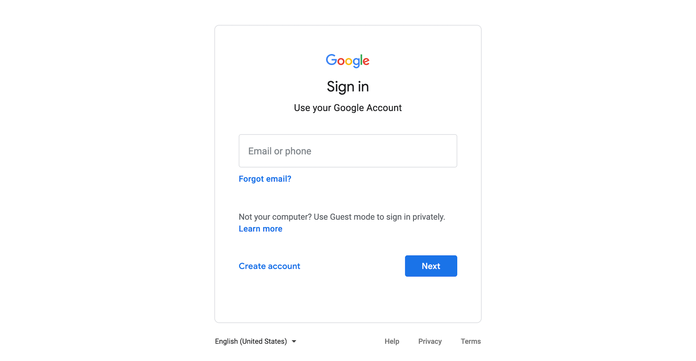

# Signing in to your Google Account

1. Go to [google.com](https://www.google.com/).
2. Click the **Sign In** button.
3. Use your [Google Account credentials](https://github.com/jjloomis/adobe-audition-2020-basics-home-edition-mac-os/tree/fc5e038db59d80027643d16930a1810754b7815e/creating-a-google-account.md) \(username and password\) to sign in.

